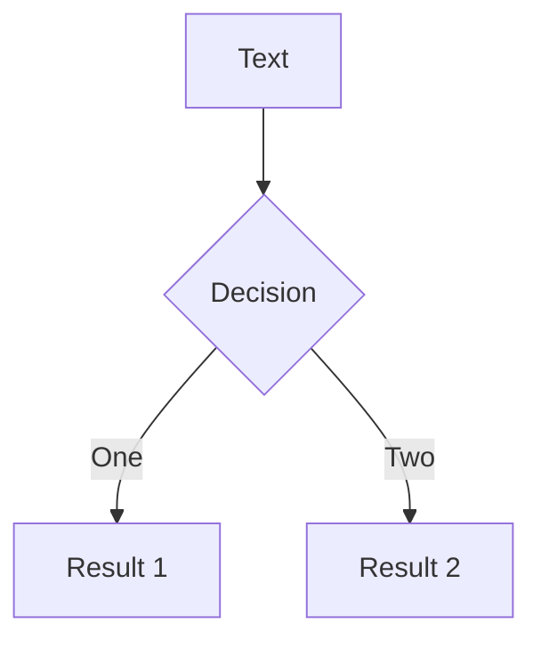

# Slidev

简单分享

<div class="pt-12">
  <span @click="$slidev.nav.next" class="px-2 py-1 rounded cursor-pointer">
   下一页 <carbon:arrow-right class="inline"/>
  </span>
</div>

---

layout: two-cols
transition: fade

---

# Page

```md
---
title: Demo
layout: cover
lineNumbers: false
background: https://source.unsplash.com/collection/94734566/1920x1080
transition: slide-left
---
```

```md
# Page One

xxxxx

---

# Page Two

xxxxxx

---

layout: two-cols
transition: slide-left

---

# Page Three
```

<template #right>

  <h1>
    Layout
  </h1>
  
  <div class="pl-2">

```jsx {1-8|10-14|16-18|all}
  <template>
    <Left>
      <slot></slot>
    </Left>
    <Right>
      <slot name="right"></slot>
    </Right>
  </template>

  // use
  ....
  <template #right>
    ...
  </template>

  // 语法糖
  ::right::
  ...
```

  </div>
</template>

---

## layout: two-cols

# Code

```tsx {all|2-4|5-9|10-|all}
function shallowEqual(objA: mixed, objB: mixed): boolean {
  if (Object.is(objA, objB)) {
    return true;
  }
  if (
    typeof objA !== 'object' ||
    objA === null ||
    typeof objB !== 'object' ||
    objB === null
  ) {
    return false;
  }
  const keysA = Object.keys(objA);
  const keysB = Object.keys(objB);
  const lengthA = keysA.length,
    lengthB = keysB.length;
  if (lengthA !== lengthB) {
    return false;
  }
  for (let i = 0; i < lengthA; i++) {
    const currentKey = keysA[i];
    if (
      !hasOwnProperty.call(objB, currentKey) ||
      !is(objA[currentKey], objB[currentKey])
    ) {
      return false;
    }
  }
  return true;
}
```

::right::

<style>
  .graph{
    display: inline-block;
    margin:20px;
  }
</style>
<h1 v-click>
Graph
</h1>
<div v-after class="graph">



</div>

---

---

# inline-style

scoped

<style>
.slidev-layout h1 {
  color: red;
  font-size: 30px
}
code {
  @apply text-teal-500 dark:text-teal-400;
}
</style>

```md
<style> 
h1 { color: red } 
code { @apply text-teal-400;}
</style>

# Next slide is not affected
```

## global

```markdown
约定：./style.css | ./styles/index.{css,js,ts}

遵循上述约定的文件将被注入到 App 的根目录中。
root/
├── ...
└── styles/
├── index.ts
├── base.css
├── code.css
└── layouts.css
import './base.css'
import './code.css'
import './layouts.css'
```

---

# Vue

slidev 有一个全局的 Vue 上下文

```jsx
<div>{{ $slidev }}</div>
```

<!-- <div>{{JSON.stringify($slidev)}}</div> -->

### 使用 Vue 组件

```jsx
import { ref } from 'vue';

const props = defineProps({
  count: {
    default: 0,
  },
});

const counter = ref(props.count);

function handleClick(num: number) {
  counter.value += num;
}
```

<Counter :count="100"/>

---

# 资源

```text

```


---

# Element-Plus
<a-button type="primary">Primary Button</a-button>
<n-button>Default</n-button>
<MenuTest></MenuTest>
---
